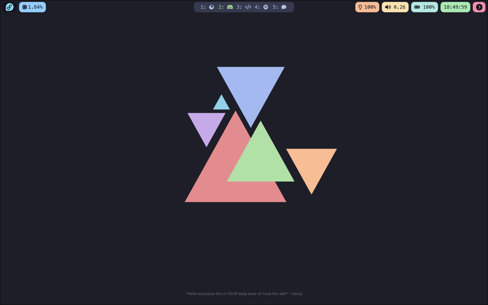
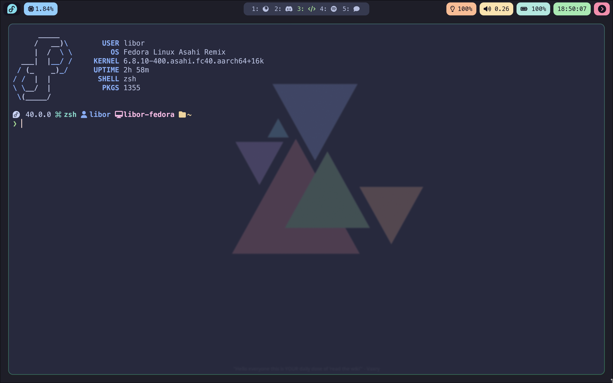

# dotfiles
Dotfiles for the first time Hyprland Theming posted by u/litszwaiboris

### If you have any questions or problems encountered in the ricing process, feel free to ask me through GitHub Issues

# Preview

# Requirements
This set of dotfiles requires the packages below:
- Waybar (Bar)
- Hyprland (Window Manager)
- Wofi (Launcher)
- Hyprlock (Lock screen)
- Grim (Screenshot)
- Hyprpaper (Background)
- Nerd Font (MesloLGS) (Font that I used)
- Light, Pipewire Utilities (Tools to be compatible with the widgets)

# Installation
Clone this repository to anywhere and run `install.sh` and it will automatically require your sudo password and install all the packages, apply needed configuration to your computer, and install the rice to your computer!

# Advanced Customization
This rice have a few components in their respective folders, follow their respective wiki for more information.

Hyprland, Hyprlock, Hyprpaper: https://wiki.hyprland.org/  
Waybar: https://github.com/Alexays/Waybar/wiki/
