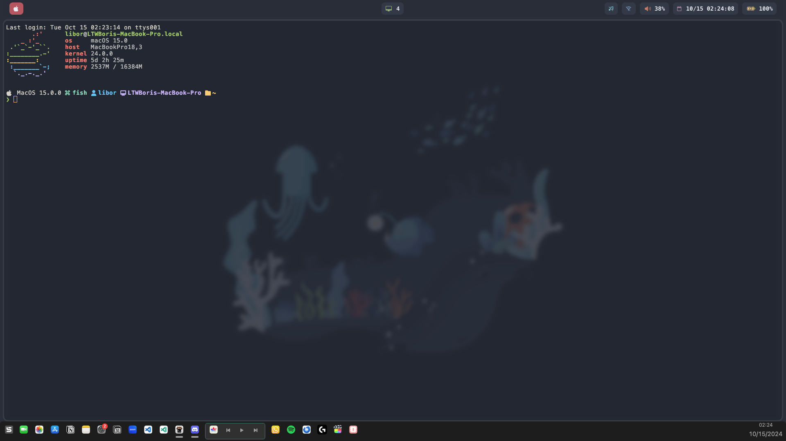

# dotfiles
Dotfiles for the first time MacOS Theming posted by u/litszwaiboris

### If you have any questions or problems encountered in the ricing process, feel free to ask me in Issues

# Preview

# Requirements
This set of dotfiles requires the packages below:
- Sketchybar (Bar)
- Aerospace (Window Manager)
- Nerd Font (MesloLGS) (Font that I used)
- SF Symbols (Partial Icons)

# Installation
Clone this repository to anywhere and run `install.sh` and it will automatically require your sudo password and install all the packages, apply needed configuration to your computer, and install the rice to your computer!

# Advanced Customization
### You can customize this rice for yourself!

### Sketchybar Plugins descriptions:
All hand crafted by me:

`aerospace.sh`: Used in the center module; Display the current workspace in Aerospace

`clock.sh`: Display the clock

`music.sh`: Used in the right music module; Display the music being played, and remove the title when it is too long

`music_check.sh`: Used in the right music module; Get informations from Spotify; Sourced by `music.sh`

`music_click.sh`: Used in the right music module; Talk to Spotify and toggle between playing and stop; Start when Spotify is not running

`net.sh`: Used in the right Wi-Fi module; Display the connection status of Wi-Fi (Can't do ethernet because of MacOS Privacy Updates

`power.sh`: Used in the right battery module; Display the status of charging/using battery and the percentage

`volume.sh`: Used in the right volume module; Display different icons when volume changes

`volume_click.sh`: Used in the right volume module; Toggle between mute or unmute

`wifi-toggle.sh`: Used in the right Wi-Fi module; Toggle between on and off for Wi-Fi
