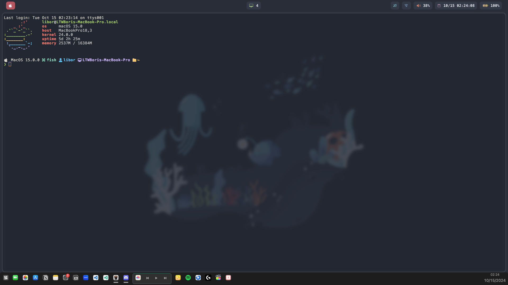

# dotfiles
Dotfiles for the first time MacOS Theming posted by u/litszwaiboris

# Preview


# Requirements
This set of dotfiles requires the packages below:
- Sketchybar (Bar)
- Yabai (Window Manager)
- Nerd Font (MesloLGS) (Font that I used)
- SF Symbols (Partial Icons)
- skhd (Shortcuts)

# Installation
Clone this repository to anywhere and run `install.sh` and it will automatically require your sudo password and install all the packages, apply needed configuration to your computer, and install the rice to your computer!

# Advanced Customization
You can customize this rice for yourself!

Workspace indicators `~/.config/sketchybarrc/sketchybarrc`:
- line 40, 41, 43, 176 (first desktop)
- line 51, 52, 54, 177 (second desktop)
- line 62, 63, 65, 178 (third desktop)
- line 73, 74, 76, 179 (fourth desktop)
- line 84, 85, 87, 180 (fifth desktop)

If you want to add workspaces:
First, Copy and replace [REPLACE_THIS!!!!] as your workspace name.
Second, replace [ICON_OF_YOUR_LIKING] as your icon and name that you like, check out either SF Symbols software in your mac or  for icons.
Third, replace the number after `click_script="yabai -m space --focus "` as the workspace number.
```
              --add space [REPLACE_THIS!!!!] left \
              --set [REPLACE_THIS!!!!] associated_display=1 \
                         associated_space=5 \
                         icon="[ICON_OF_YOUR_LIKING]" \
			 icon.padding_left=10 \
			 icon.padding_right=10 \
                         click_script="yabai -m space --focus 5" \
                         background.color=0xffD8DEE9 \
                         background.drawing=off \
              --subscribe misc mouse.entered mouse.exited \
                                                                 \
```

If you want to delete one of the workspaces:
- line 51-61 (second desktop)
- line 62-72 (third desktop)
- line 72-83 (fourth desktop)
- line 84-94 (fifth desktop)


Icons for plugins:

Spotify Player `~/.config/sketchybar/plugins/music.sh`
- line 36 (Spotify running)
- line 41 (Spotify closed)

Wifi `~/.config/sketchybar/plugins/net.sh`
- line 6 (wifi enabled and on)
- line 10 (wifi disabled)

Volume `~/.config/sketchybar/plugins/volume.sh`
- inside `case` and `esac` start from 5 to 16 (volume icon)

Date and time `~/.config/sketchybar/sketchybarrc`
- line 130

Battery `~/.config/sketchybar/plugins/power.sh` 
- line 12 (charging icon)
- inside `case` and `esac` start from line 19 to 30 (normal icon)