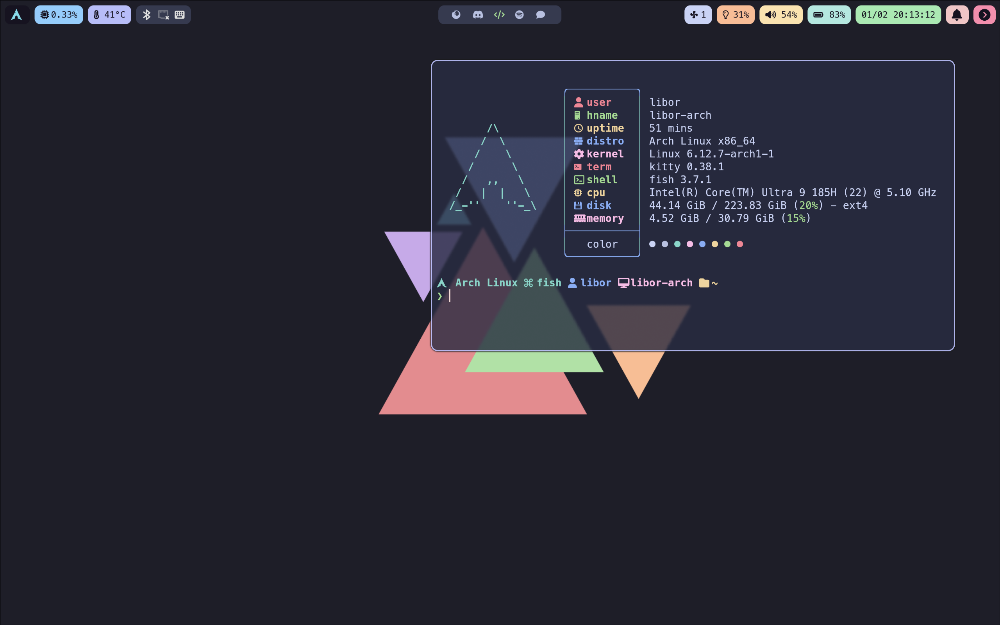
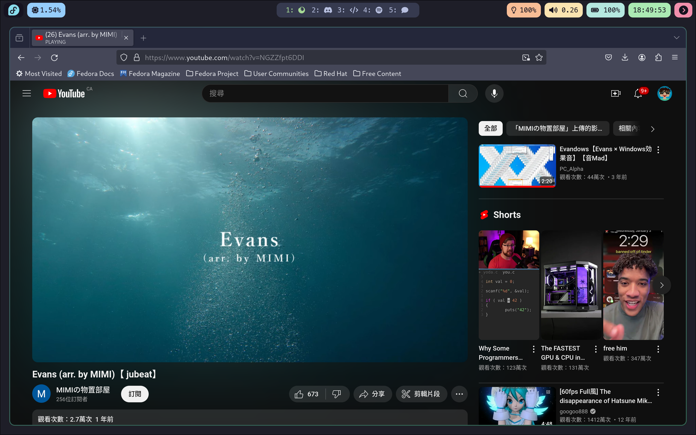
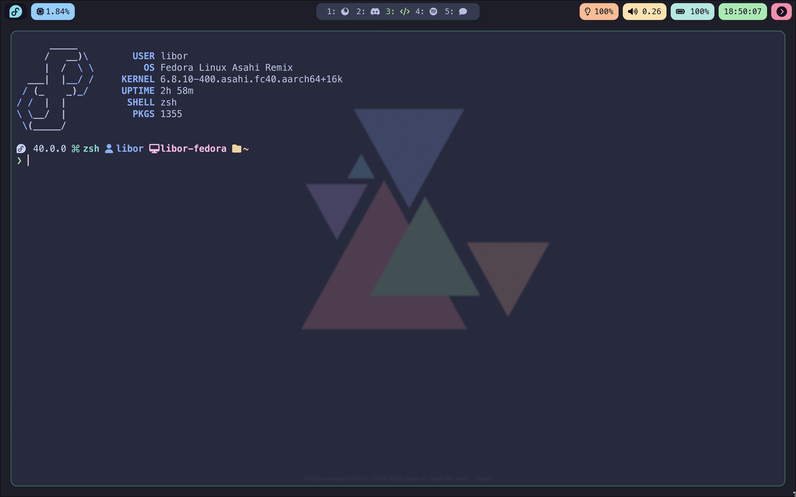

# dotfiles
Dotfiles for the first time Hyprland Theming posted by u/litszwaiboris

### If you have any questions or problems encountered in the ricing process, feel free to ask me through GitHub Issues

# Preview

# Requirements
This set of dotfiles requires the packages below:
- Waybar (Bar)
- Hyprland (Window Manager)
- Fuzzel (Launcher)
- Hyprlock (Lock screen)
- Grim (Screenshot)
- Hyprpaper (Background)
- SwayNC (Notification Center)
- SDDM (Login Manager)
- Nerd Font (MesloLGS) (Font that I used)
- Papirus Icon Theme
- Light, Pipewire Utilities (Tools to be compatible with the widgets)

# Installing Prerequisites
### Arch Linux
`sudo pacman -S fish fuzzel hyprland hyprlock hyprpaper kitty starship swaync waybar sddm grim slurp pipewire pipewire-pulse ttf-meslo-nerd qt5-graphicaleffects qt5-svg qt5-quickcontrols2 papirus-icon-theme python python-gobject scdoc fakeroot base-devel && git clone https://aur.archlinux.org/blight ~/blight && cd ~/blight && makepkg -si`

### Fedora
`sudo dnf install fish fuzzel hyprland hyprlock hyprpaper kitty starship swaync waybar sddm grim slurp pipewire-utils pipewire-pulseaudio light qt5-qtsvg qt5-qtgraphicaleffects qt5-qtquickcontrols2 papirus-icon-theme`

For Fedora, you have to manually download MesloLGS Regular font with this link:
[MesloLGS NF Regular](https://github.com/romkatv/dotfiles-public/blob/master/.local/share/fonts/NerdFonts/MesloLGS%20NF%20Regular.ttf)

# Installation
### Any Linux
`git clone https://github.com/litszwaiboris/dotfiles ~/dotfiles && cd ~/dotfiles && git checkout linux-hypr && ./install.sh`

# Advanced Customization
This rice has a few components in their respective folders, follow their respective wiki for more information.

Hyprland, Hyprlock, Hyprpaper: https://wiki.hyprland.org/  
Waybar: https://github.com/Alexays/Waybar/wiki/
SwayNC: https://github.com/ErikReider/SwayNotificationCenter

For the scrolling feature on the backlight widget to work correctly, so it actually executes the command, please substitute the `on-scroll-up` and `on-scroll-down` command to be respectively `light -A 5` and `light -U 5`

# Credits
The SDDM Theme is from the Corners theme by [@aczw](https://github.com/aczw)

The Nerd Fonts by [@ryanoasis](https://github.com/ryanoasis)

The creators behind SwayNC, Fuzzel, and the Hypr Team
